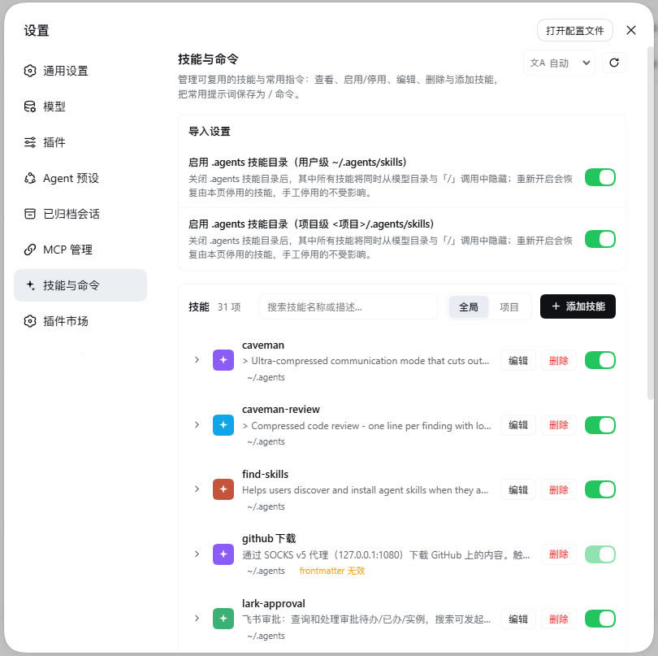
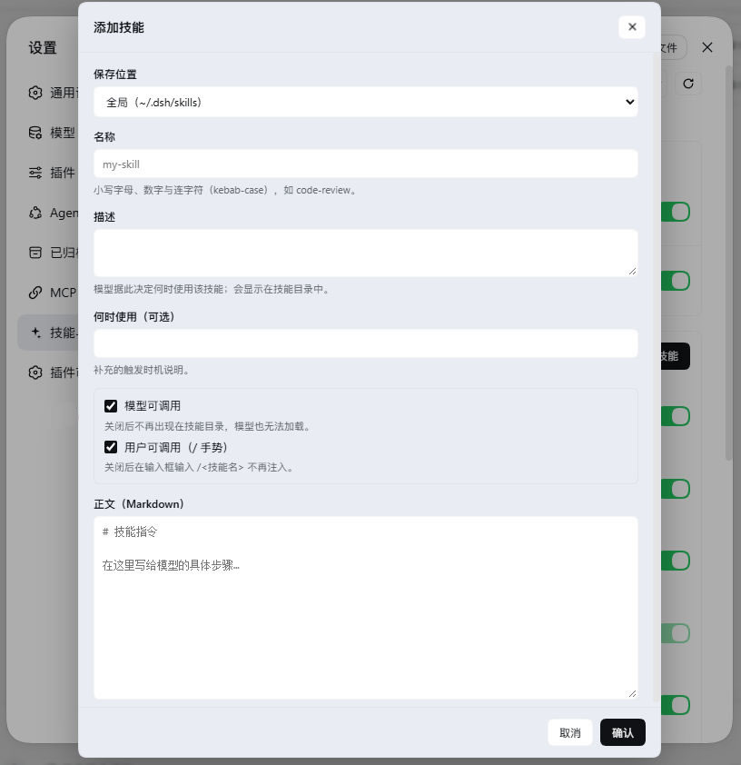
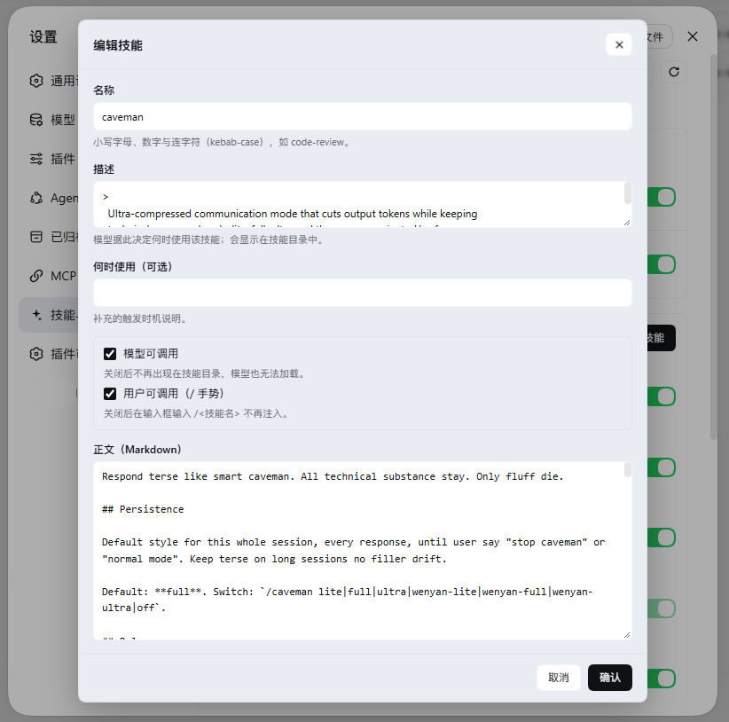
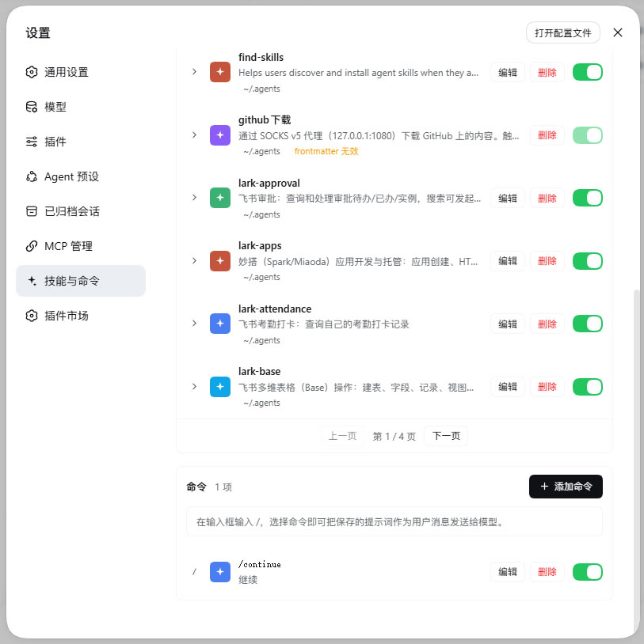
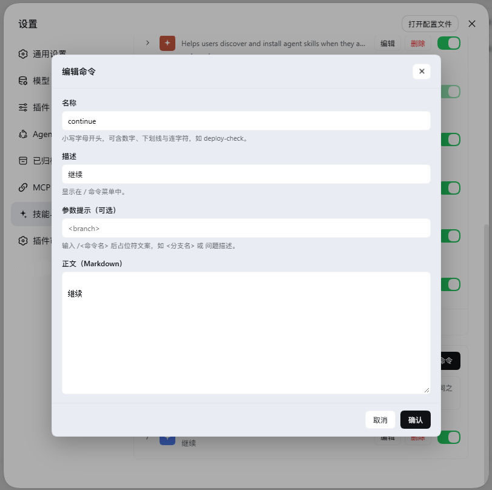

# dsh-skills-manager-plus

[English](README.en.md) | 中文 | [Changelog](CHANGELOG.md)

Skills & commands manager plugin for DeepSeek Harness. Adds a **"技能与命令" (Skills & Commands)** page to the left sidebar of the Settings screen, where you can view, enable/disable, edit, delete and add skills, and save frequent prompts as `/commands` that you invoke by typing `/`.

## Screenshots

| Skill list | Add skill |
| --- | --- |
|  |  |

| Edit skill | Commands | Edit command |
| --- | --- | --- |
|  |  |  |

## Features

| Capability | Description |
| --- | --- |
| List | Shows every skill under the skill roots, switchable between **Global / Project** scopes |
| Body preview | Expand a row to preview the skill body in Markdown |
| Enable / disable | Rewrites skill frontmatter (model-invocable / user-invocable); the directory watcher picks it up live without a restart |
| Edit | Name, description, when-to-use, the two invocation switches and the body; renaming renames the directory |
| Delete | Removes the skill's `SKILL.md` (the resource directory too, for directory-form skills) |
| Add | Creates a new kebab-case skill in the global scope or a chosen project |
| Search / pagination | Filter by name or description; 10 rows per page |
| Commands | Save a prompt as `/command`; picking one sends the prompt to the model as a user message |
| Import settings | One-click enable / disable of the `.agents` skill directories (user and project), restoring only the skills this page disabled |
| i18n | Chinese / English, follows the UI language, overridable and remembered in the top-right |

## Install

**Requires:** DeepSeek Harness (DSH) ≥ 0.1.5-rc.1 (developed and tested on 0.1.6-alpha.1), which itself needs Node.js ≥ 24.2.0 and Git ≥ 2.31.0.

### One-click install from the plugin market

If you have `https://github.com/dsh-market/dsh-market` installed, open **Settings → Plugin Market,** search for `dsh-skills-manager-plus` and click install.

### CLI

```sh
# Local directory (link install; changes apply immediately, handy for development)
dsh plugin --profile web add <this repo directory>

# Then restart dsh (or wait for the profile to hot-reload); the page appears under Settings → Skills & Commands
```

### Verify

Open dsh web → **Settings → Skills & Commands** (the spark-icon sidebar item). If the page is missing:

1. Use a current Chrome/Edge — bundles can fail to load on older Chromium kernels;
2. Confirm it is installed into the active profile (`dsh plugin --profile web ls`);
3. If the browser console logs an error, report it with the error when opening an issue.

### Update / uninstall

```sh
dsh plugin --profile web ls                          # list installed plugins
dsh plugin --profile web add <this repo directory>   # update (re-add overwrites)
dsh plugin --profile web remove dsh-skills-manager-plus # uninstall
```

## Where things live

Skills are the skill filesystem itself — the same roots the DSH skill provider scans:

```
~/.dsh/skills                           user skills
~/.agents/skills                        user .agents skills
<project>/.dsh/skills                   project skills
<project>/.agents/skills                project .agents skills
```

Each skill is a `<name>/SKILL.md` (or a flat `<name>.md`) with YAML frontmatter. Enable/disable rewrites the `disable-model-invocation` and `user-invocable` keys; every other field (including unmodelled nested fields) is preserved byte-for-byte.

Commands live under:

```
$DSH_HOME/commands/<name>.md
```

One Markdown file per command, with `name`, `description` and optional `argument-hint` frontmatter; the body is the saved prompt. Files are watched, so add/edit/delete re-registers on the DSH command registry within about a second, without a restart.

The plugin keeps one small state file (`$DSH_HOME/skills-manager-plus.json`) tracking the import switches, disabled command names, and exactly which skills this page disabled in bulk — turning the `.agents` switch back on only restores those, never ones disabled by hand.

## Safety

- **Loopback only.** The API sits on the same loopback web server; non-loopback sources get a 403.
- **Writes are confined to the managed roots.** A submitted path outside them is refused.
- **State file is written atomically** and validated on load; unparseable state resets to defaults.
- **Commands go out as user messages.** Invoking `/command` submits the prompt via `agent.followup` as an ordinary user message, so permissions and logging behave exactly as if the user typed it.

## Development

```sh
node test/run.mjs          # all tests (31) across three suites
```

| Suite | Coverage |
| --- | --- |
| `test/store.test.mjs` | Pure logic of `skills.js` / `commands.js`: frontmatter parse/rewrite, skill & command CRUD, validation, root resolution |
| `test/host.test.mjs` | All host HTTP routes via a fake Cordis context driving the real `apply()`, incl. loopback guard and the `.agents` switch |
| `test/client.test.mjs` | Loads the browser bundle like the shell does and asserts it registers a `settings.section` page |

Tests use only Node's built-in `node:test`.

### Layout

| File | Role |
| --- | --- |
| `lib/index.js` | Host half: loopback HTTP API, state file, `.agents` import switches |
| `lib/skills.js` | Skill file model: frontmatter parse/rewrite, skill CRUD, root resolution |
| `lib/commands.js` | Command store: file read/write, file watching, registration on the DSH command registry |
| `lib/client.js` | Browser half: the settings page UI (hand-written lazy-CJS bundle, no build step) |
| `cordis.patch.yml` | Bundle patch that inserts this plugin into a profile's layer stack |

## License

MIT